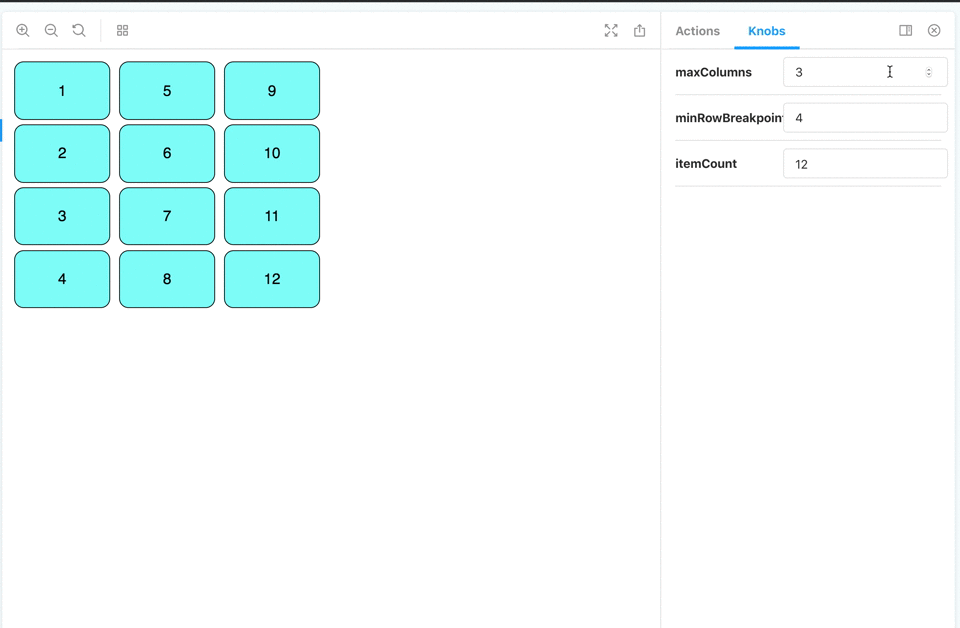

# React Balanced Columns

## Setup

### Description

This component divides a list up into columns that "balance" themselves dynamically when both a max number of columns and min length to fill a column is specified.

### Installation

Install using the package manager of your choice:

`npm install react-balanced-columns` or `yarn add react-balanced-columns`

then include the component in your project:

`import { BalancedColumns } from 'react-balanced-columns'`

### Props

| PropName           | IsRequired | Type                                                                           | Description                                                                                                                                                                    |
| ------------------ | ---------- | ------------------------------------------------------------------------------ | ------------------------------------------------------------------------------------------------------------------------------------------------------------------------------ |
| _children_         | true       | Array<[React.Children](https://reactjs.org/docs/react-api.html#reactchildren)> | This component accepts an array of react children that will be balanced across the rendered columns.                                                                           |
| _minRowBreakpoint_ | true       | number                                                                         | The **minimum** number of rows that must be filled before proceeding to fill the next column. Note: given is a minimum each column may be longer than this length.             |
| _maxColumns_       | true       | number                                                                         | The **maximum** number of columns allowed. Note: given this is a maximum, there may be fewer columns than this number.                                                         |
| _columnWidth_      | false      | number                                                                         | An optional field whose units are in _pixels_. It allows an exact width to be specified. The default is flex-basis auto, which will grow to accommodate width of the children. |

## Examples

Below are some examples of how changing each of the props changes the end result.

#### Changing number of children

<figure><figcaption>Here we increment the number of items in the set. Only when all columns are maxed out do we add a new row and rebalance the list.</figcaption></figure>

#### Changing maxColumns

<figure><figcaption>Here we change the value of maxColumns, demonstrating it is possible to have fewer than the max if the list is not big enough, but never more.</figcaption></figure>

#### Changing minRowBreakpoint

<figure><figcaption>Here we increment the value of minRowBreakpoint, demonstrating that each column will have at least that many rows before filling the next column.</figcaption></figure>

## Contributing

Clone the project and run `npm install`. `npm run storybook` will spawn a staging ground to demo any changes to the component. Eslint and prettier are used for code formatting. TypeScript is used for the type-system and for transpilation to an es5 dist.
