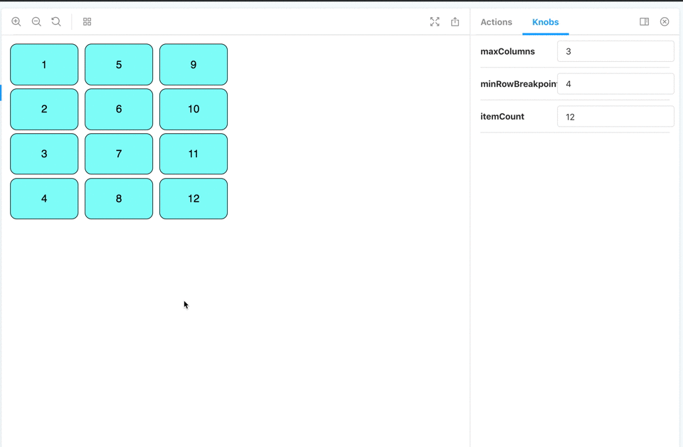

# React Balanced Columns

### Description
This component divides a list up into columns that "balance" themselves dynamically.

### Props

|PropName|IsRequired|Type|Description|
|---|---|---|---|
|*children*|true|Array<[React.Children](https://reactjs.org/docs/react-api.html#reactchildren)>|This component accepts an array of react children that will be balanced across the rendered columns.| 
|*minRowBreakpoint*|true|number|The **minimum** number of rows that must be filled before proceeding to fill the next column. Note: given is a minimum each column may be longer than this length.|
|*maxColumns*|true|number|The **maximum** number of columns allowed. Note: given this is a maximum, there may be fewer columns than this number.|
|*columnWidth*|false|number|An option field that will convert to *pixels*, allowing for a specific the width. The default is auto, which will grow to accommodate the children.|

### Examples

Feel to clone this project down run `npm install` and then `npm run storybook` to see a demo of the component. Below are some examples of how changing each of the props changes the end result.

#### Changing number of children
<figure><figcaption>Here we increment the number of items in the set. Only when all columns are maxed out do we add a new row and rebalance the list.</figcaption></figure>

#### Changing maxColumns
<figure><figcaption>Here we change the value of maxColumns, demonstrating it is possible to have fewer than the max if the list is not big enough, but never more.</figcaption></figure>

#### Changing minRowBreakpoint
<figure><figcaption>Here we increment the value of minRowBreakpoint, demonstrating that each column will have at least that many rows before filling the next column.</figcaption></figure>